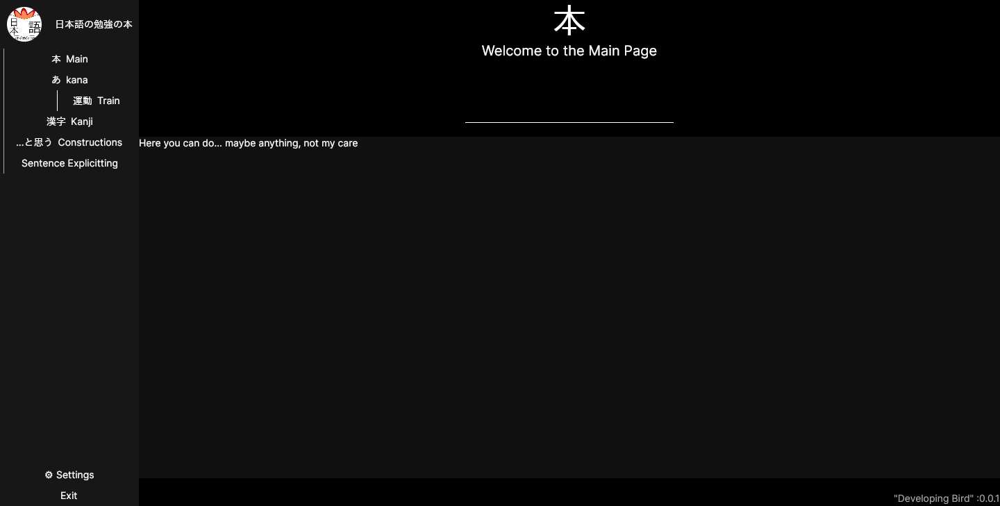

# 
Nihongo no bekiyo no hon

日本語の勉強の本 

 

###### 
  *An __useless__ helper in your Japanese study* :unamused:

### 
Version 0.0.1 "Developing Bird"

</img>
###### 
 Main Window Example 

### Platforms :computer: (Desktop only)
- [x] Linux (Win 10>)
- [x] Windows (Ubuntu tested)
- [x] Mac (Untested)

# What is it?
An instrument that can (or not) help you with your studies of Japanese language. Nothing special, to be honest.

## Version 0.0.1 :hammer::bird:
- Kana
  - [x] Full Kana table 
  - [ ] Searching
  - [ ] Kana memorize training
  - [x] Postgres support
  - [ ] WebAPI support

- Kanji
  - [x] Kanji Table (not full) with descriptions, meanings and keys
  - [x] Dictionary to image(-s) for printing
  - [ ] Postgres support
  - [ ] WebAPI support
- Examples for practice
  - [ ] Video/Audio (gif/Opus)
  - [ ] Audio (Opus)
  - [ ] Images 
  - [ ] Text

# Support Languages :page_with_curl: (In dev.)
  - :gb:/:us: English (UI)
  - :ru: Russian (UI)
  - :jp: Japanese (UI elements)

# Used libraries? </>
  - See [__NOTICE__ file](./NOTICE.md)

# Published with <ins>"The MIT License"</ins>
  - See [__LICENSE__ file](./LICENSE)